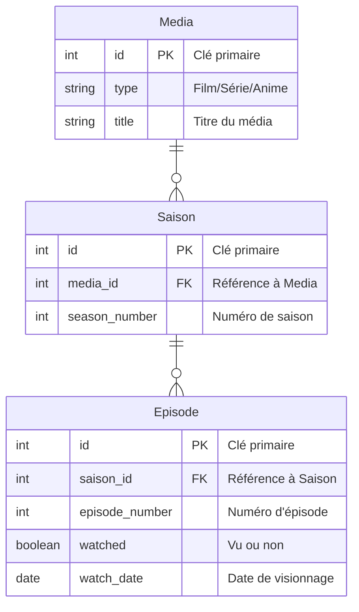

```mermaid
    erDiagram
        Media ||--o{ Saison : ""
        Saison ||--o{ Episode : ""

        Media {
            int id PK "Clé primaire"
            string type "Film/Série/Anime"
            string title "Titre du média"
        }
        
        Saison {
            int id PK "Clé primaire"
            int media_id FK "Référence à Media"
            int season_number "Numéro de saison"
        }
        
        Episode {
            int id PK "Clé primaire"
            int saison_id FK "Référence à Saison"
            int episode_number "Numéro d'épisode"
            boolean watched "Vu ou non"
            date watch_date "Date de visionnage"
        }
```